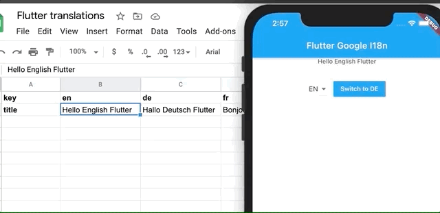

# flutter-google-i18n-demo

Demo of internationalizing a Flutter app using Google spreadsheet.
The source code for the package is available here: https://github.com/macav/flutter-google-i18n

## Getting Started

The app fetches translations from Google spreadsheet located here:
https://docs.google.com/spreadsheets/d/1TGbtKpdNRptYwUVtqmkI2L7Ix00i-fQMnrChGHx2Ajk/edit?usp=sharing

It caches the data for offline use and if there's no internet connection, it will automatically use the cached data.

## How to get the spreadsheet JSON link

Open the spreadsheet with the translations, which is structured in the same way as the demo one.
Now you need to also publish the document to the web. 
Click on File -> Publish to the web -> Publish. You can ignore the link provided.

Then you need to get a shareable link.
Click on File -> Share -> Get link
You will get a link in the following format:
https://docs.google.com/spreadsheets/d/<SPREADSHEET_IDENTIFIER>/edit?usp=sharing

Now replace the identifier in the following link:
https://spreadsheets.google.com/feeds/list/<SPREADSHEET_IDENTIFIER>/1/public/values?alt=json

You should get the spreadsheet data in a JSON format.
A link for this demo looks like this:
https://spreadsheets.google.com/feeds/list/1TGbtKpdNRptYwUVtqmkI2L7Ix00i-fQMnrChGHx2Ajk/1/public/values?alt=json
